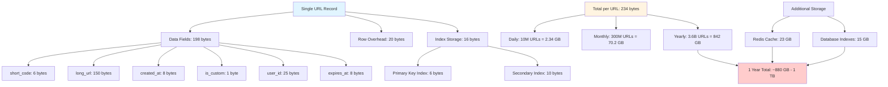
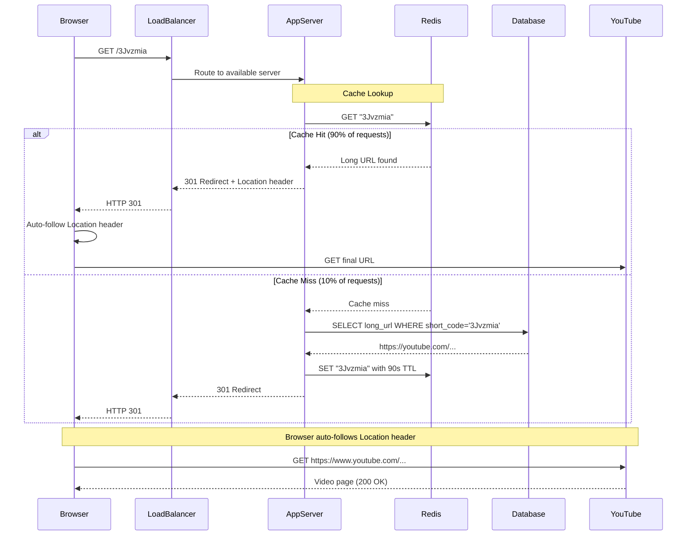
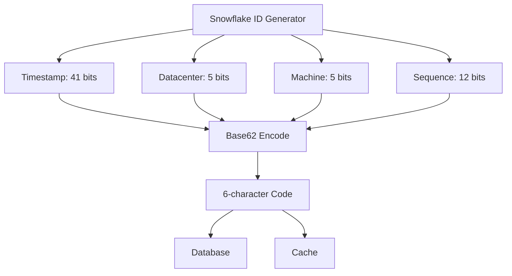
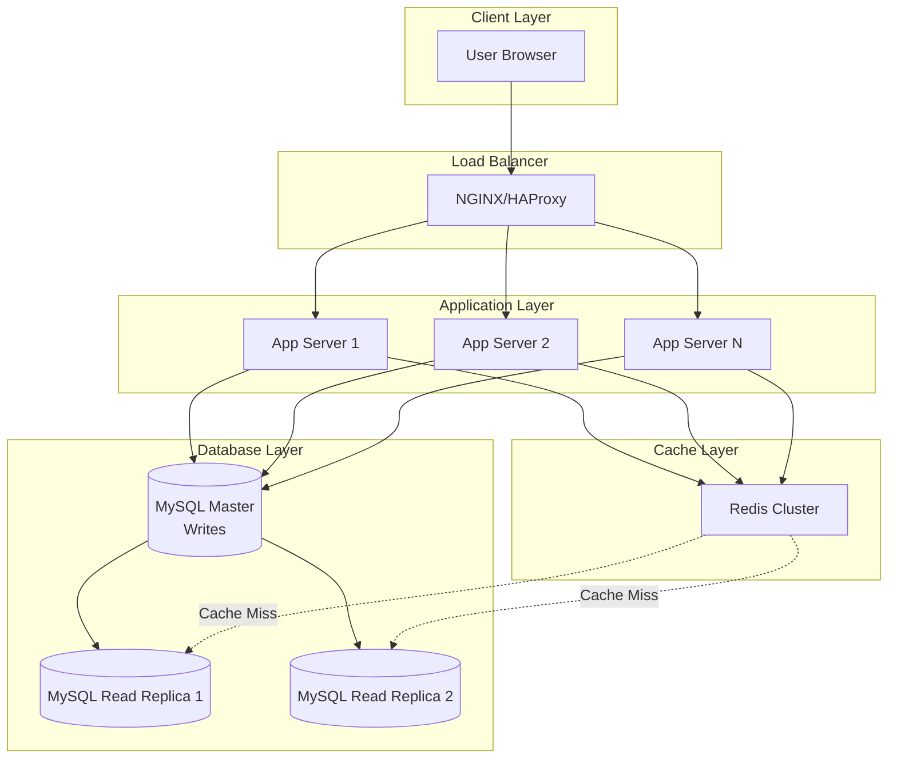
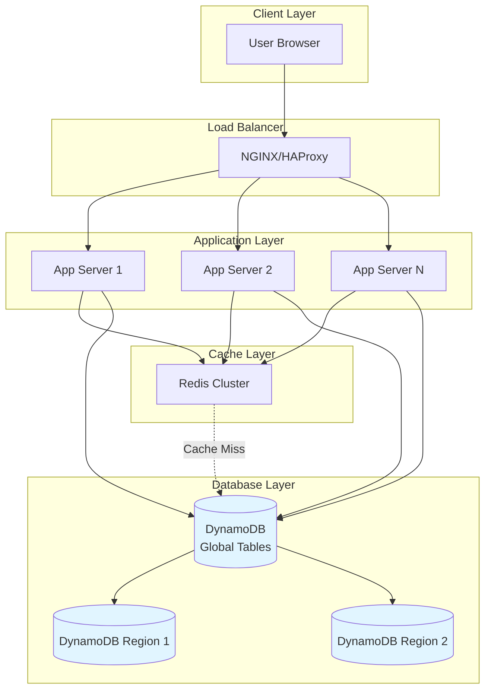
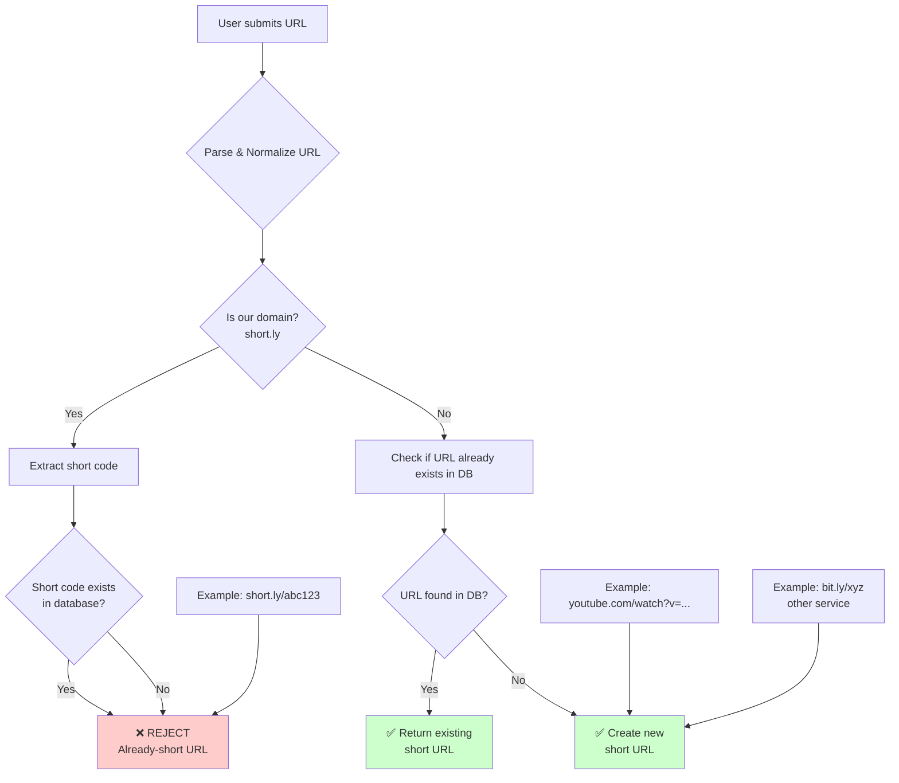
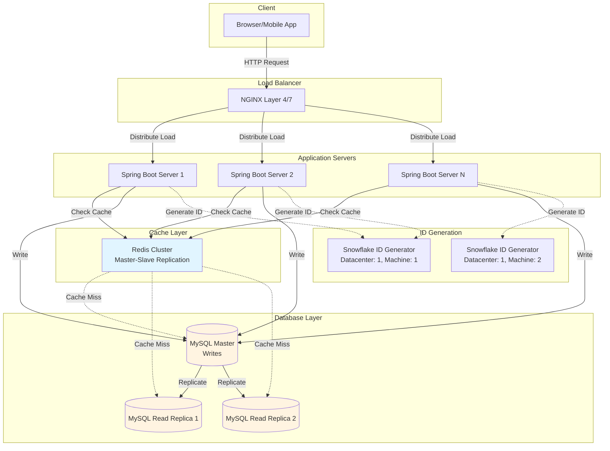
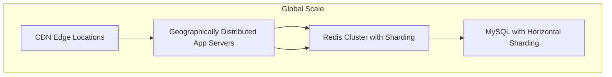

# Building a URL Shortener: From Idea to Production System

> How does your favorite link shortener actually work? Let's design bit.ly from scratch and uncover the engineering decisions that power billions of redirects.

---

## A Real-World Problem

**Aadvik (Interviewer):** "Sara, imagine you're building Medium. Your authors are sharing 10,000-word articles, and each share link looks like this: `https://medium.com/@author-name/why-i-quit-my-6-figure-job-to-pursue-my-dream-of-becoming-a-musician-l4k9m2n8p1q`. That's 85 characters. Twitter character limits? Instagram bios? Email signatures? They all become nightmares."

**Sara (Candidate):** *[Thoughtful pause]* "That's exactly why services like bit.ly exist! These long URLs are terrible for user experience. Users can't easily share them, they look unprofessional, and they take up space."

**Aadvik:** "Exactly. Let's design the system behind bit.ly. Not just a simple redirect service, but one handling billions of clicks. Ready to tackle this?"

**Sara:** "Absolutely. Let me think about what questions I should ask first to understand the scope... Here are my clarifying questions:
- What's the scale we need to handle? Read vs write ratio?
- What should be the character length of the short URL?
- What's the acceptable latency?
- How long should these shortened URLs be valid?
- Should we handle custom short URLs?
- Any analytics requirements?"

**Aadvik:** "Great questions, Sara. Let's define the requirements:

**Functional Requirements:**
1. Shorten a long URL to 6-character string (case-sensitive alphanumeric + some symbols)
2. Redirect to the original URL
3. URLs should not expire (for simplicity)
4. Handle custom short URLs

**Non-Functional Requirements:**
1. Scale: 100 million URLs shortened, 100:1 read/write ratio (read-heavy)
2. Latency: <200ms for shortening, <100ms for redirect
3. 99.9% availability
4. Should handle custom short URLs

**Scale Estimation:**

**Traffic:**
- Writes: 10 million URLs/day ≈ 115 URLs/sec
- Reads: 1 billion redirects/day ≈ 11,500 requests/sec
- Peak load: 5x average ≈ 500 URLs/sec writes, 57,500 reads/sec

**Storage Estimation - Detailed Breakdown:**

Let's calculate the storage requirements by examining what we store in the database:

**Database Table Schema:**
```sql
CREATE TABLE url_mappings (
    short_code VARCHAR(10) PRIMARY KEY,      -- e.g., "abc123"
    long_url VARCHAR(2048) NOT NULL,         -- Original URL
    created_at TIMESTAMP,                    -- Creation time
    is_custom BOOLEAN,                       -- Custom alias flag
    user_id VARCHAR(50),                     -- Optional user tracking
    expires_at TIMESTAMP NULL                -- Optional expiry
);
```

**Storage Calculation Per Row:**

| Field | Type | Size Calculation | Bytes |
|-------|------|------------------|-------|
| `short_code` | VARCHAR(10) | Average length: 6 chars × 1 byte | 6 bytes |
| `long_url` | VARCHAR(2048) | Average length: 150 chars × 1 byte | 150 bytes |
| `created_at` | TIMESTAMP | Fixed 8 bytes | 8 bytes |
| `is_custom` | BOOLEAN | Fixed 1 byte | 1 byte |
| `user_id` | VARCHAR(50) | Average: 25 chars × 1 byte (nullable) | 25 bytes |
| `expires_at` | TIMESTAMP | Fixed 8 bytes (nullable) | 8 bytes |
| **MySQL Row Overhead** | - | Fixed overhead per row | 20 bytes |
| **Primary Key Index** | - | For `short_code` (6 bytes) | 6 bytes |
| **Secondary Index (created_at)** | - | 8 bytes (timestamp) + overhead | 10 bytes |

**Total Storage Per Row:**
- Data: 6 + 150 + 8 + 1 + 25 + 8 = **198 bytes**
- Row Overhead: **20 bytes**
- Index Storage: 6 + 10 = **16 bytes**
- **Total per URL record: ≈ 234 bytes**

**Storage Over Time:**

| Period | URLs | Storage Calculation | Total Storage |
|--------|------|---------------------|---------------|
| **Per Day** | 10 million | 10M × 234 bytes | 2.34 GB |
| **Per Month** | 300 million | 300M × 234 bytes | 70.2 GB |
| **Per Year** | 3.6 billion | 3.6B × 234 bytes | 842.4 GB (~0.82 TB) |
| **5 Years** | 18 billion | 18B × 234 bytes | 4.2 TB |

**Additional Storage Considerations:**

1. **Cache Storage (Redis):**
   - Same data cached with TTL
   - 100 million active URLs × 234 bytes ≈ **23.4 GB** (assuming cache size of 20% total URLs)

2. **Index Storage:**
   - Primary key index: ~10% of data = **8.4 GB** (for 1 year)
   - Secondary index (created_at): ~8% of data = **6.7 GB**
   - Total index overhead: ~**15 GB** per year

3. **Annual Storage Summary:**
   - Raw data: **842 GB**
   - Indexes: **+15 GB**
   - Cache: **+23 GB** (active)
   - **Total: ~880 GB to 1 TB per year**

**Design Decision:** With this scale, we should plan for:
- Database sharding after 1 year (~1 TB)
- Archival strategy for old URLs
- Compression for rarely accessed URLs
- Consider blob storage for very large URL history

**Visual Storage Breakdown:**


### Sample Calculation Walkthrough

**Aadvik:** "Let me walk you through a concrete example. Say we shorten this URL: `https://www.example.com/products/item/12345?color=red&size=large`"

**Step-by-step calculation:**

1. **Store the data:**
   - Short code generated: `aBc123` (6 bytes)
   - Long URL: `https://www.example.com/products/item/12345?color=red&size=large` (72 bytes)
   - Created at: `2024-01-15 10:30:00` (8 bytes)
   - Is custom: `false` (1 byte)
   - User ID: `user_abc123xyz` (16 bytes, assuming they're logged in)
   - Expires at: `NULL` (0 bytes, not expired yet)
   
2. **Calculate row size:**
   - Data: 6 + 72 + 8 + 1 + 16 + 0 = **103 bytes**
   - Row overhead: **20 bytes**
   - Total row: **123 bytes**

3. **Add indexes:**
   - Primary key index (short_code): **6 bytes**
   - Secondary index (created_at): **10 bytes**
   - Index overhead: **16 bytes**

4. **Total storage for one URL:** 123 + 16 = **139 bytes**

*Note: This is smaller than our average (234 bytes) because the URL is shorter. Our 150-byte average accounts for longer URLs.*

**Aadvik:** "Now scale this up. If we have 10 million URLs per day:"

**Calculation:**
- 10 million URLs × 234 bytes average
- = 2,340,000,000 bytes
- = 2.34 GB per day
- × 365 days = **854 GB per year**

**Sara:** "Got it. So I need to plan for roughly 1 TB of database storage per year, plus Redis cache overhead."

---

## Part 2: Design Discussion

### Step 1: API Design

**Aadvik:** "Let's start with the API. What endpoints do we need?"

**Sara:** "We need two main operations:
1. POST to shorten a URL
2. GET to redirect to original URL"

**Aadvik:** "Good. What would the request/response look like?"

**API Design:**
```java
// Shorten URL endpoint
POST /api/v1/shorten
Request Body:
{
  "longUrl": "https://example.com/very/long/path?params=value",
  "customAlias": "optional-custom-code"
}

Response (when customAlias NOT provided):
{
  "shortUrl": "https://short.ly/abc123",
  "createdAt": "2024-01-15T10:30:00Z"
}

Response (when customAlias IS provided):
{
  "shortUrl": "https://short.ly/my-blog",
  "customAlias": "my-blog",
  "createdAt": "2024-01-15T10:30:00Z"
}

// Redirect endpoint
GET /{shortCode}
Response: 301/302/307 Redirect to original URL
```

**Aadvik:** "What if someone wants a custom alias like 'short.ly/mypage'?"

**Sara:** "We can handle that in the same endpoint. If customAlias is provided, we validate it's available and use it. Otherwise, we generate a unique code."

**Aadvik:** "Perfect. Now let me show you a real-world example from bit.ly that demonstrates exactly what we're designing."

### Real-World Example: Bit.ly Redirect Flow

Let's analyze a real redirect from bit.ly to understand the HTTP flow:

**Short URL:** `https://bit.ly/3Jvzmia`

**Request Flow:**
```
1. Client requests: GET https://bit.ly/3Jvzmia
2. Server responds: 301 Moved Permanently
3. Client automatically follows redirect to long URL
```

**HTTP Headers Analysis:**

```http
Request Headers:
:authority: bit.ly
:method: GET
:path: /3Jvzmia
:scheme: https
Accept: text/html,application/xhtml+xml,...

Response Headers:
Status Code: 301 Moved Permanently
Location: https://www.youtube.com/watch?v=JQDHz72OA3c&t=1s
Cache-Control: private, max-age=90
Content-Type: text/html; charset=utf-8
Server: nginx
```

**Aadvik:** "What do you notice about this response?"

**Key Observations:**

**Sara:** "Several important things:

1. **Status Code: 301** - This is a permanent redirect
   - Search engines will update their index
   - Browsers will cache the redirect
   - Unlike 302 (temporary), this tells crawlers the short URL is the canonical one

2. **Location Header** - Contains the actual destination URL
   - This is where the browser automatically navigates
   - The long URL is: `https://www.youtube.com/watch?v=JQDHz72OA3c&t=1s`

3. **Cache-Control: max-age=90** - Server tells clients to cache this redirect for 90 seconds
   - Reduces load on bit.ly servers
   - Balances freshness with performance

4. **Content-Length: 105 bytes** - Small HTML body (probably a fallback for old browsers)

5. **Via: 1.1 google** - The request went through Google's infrastructure

6. **X-Robots-Tag: noindex** - Prevents search engines from indexing the short URL page itself"

**Aadvik:** "Great analysis! Now let's implement this behavior in our Java controller."

### Implementation: Redirect Response

```java
@RestController
@RequestMapping("/")
public class URLRedirectController {
    
    @Autowired
    private URLShortenerService service;
    
    @GetMapping("/{shortCode}")
    public ResponseEntity<Void> redirect(
            @PathVariable String shortCode,
            @RequestHeader(value = "User-Agent", required = false) String userAgent) {
        
        // Get original URL from service
        String longUrl = service.getLongUrl(shortCode);
        
        // Return 301 permanent redirect
        return ResponseEntity
            .status(HttpStatus.MOVED_PERMANENTLY)
            .header("Location", longUrl)
            .header("Cache-Control", "private, max-age=90")  // Cache for 90 seconds
            .header("X-Robots-Tag", "noindex")                // Don't index this page
            .build();
    }
}
```

**Aadvik:** "Why 301 vs 302 vs 307?"

**Sara:** "Let me break down the redirect status codes:

**301 (Permanent Redirect):**
- Better for SEO - search engines treat short URL as permanent alias
- Browser caches the redirect aggressively
- HTTP method is changed to GET (if originally POST)
- But: can't change destination later without breaking cached redirects
- **Best for:** URL shorteners when URL mapping won't change

**302 (Found / Temporary Redirect):**
- More flexible - can change destination dynamically
- HTTP method is changed to GET (if originally POST)
- But: less SEO-friendly, browsers cache less
- Better for analytics tracking (every request hits our server)
- **Best for:** A/B testing, dynamic content, analytics-heavy use cases

**307 (Temporary Redirect - Method Preserved):**
- Similar to 302 but preserves the HTTP method
- If original request was POST, redirected request stays POST
- More semantically correct for REST APIs
- **Best for:** API redirects where method matters

**Recommendation for URL shorteners:** Use 301 for simplicity and SEO, 302 if you need dynamic redirects or detailed analytics, and 307 if you're building an API gateway."

**Aadvik:** "What about the cache duration? Why 90 seconds?"

**Sara:** "Trade-off between freshness and server load:
- Longer TTL (e.g., 3600 seconds): Better cache hit rate, lower load
- Shorter TTL (e.g., 30 seconds): More accurate for URL changes
- 90 seconds: Good middle ground, allows URL updates while benefiting from caching"

**Aadvik:** "Excellent. Now, before you worry about what happens if someone shortens `short.ly/abc123` to itself, let's move to the database design."

### Visual: HTTP Redirect Flow



**Key Takeaways from this flow:**

1. **Browser auto-follows:** The browser automatically makes a second request to the Location header
2. **Caching strategy:** Redis cache reduces database load (90% cache hit rate expected)
3. **301 status:** Tells browser and search engines this is a permanent redirect
4. **Layer of indirection:** Our server never returns the actual content, just a redirect

---

### Step 2: Database Design

**Aadvik:** "Now let's think about data storage. What information do we need to store?"

**Sara:** "We need:
- Short code (primary key)
- Long URL
- Creation timestamp
- Custom alias flag
- Maybe user ID for analytics"

**Aadvik:** "Design the database schema."

**Database Schema:**
```java
// MySQL Schema
CREATE TABLE url_mappings (
    short_code VARCHAR(10) PRIMARY KEY,  -- e.g., "abc123"
    long_url VARCHAR(2048) NOT NULL,
    created_at TIMESTAMP DEFAULT CURRENT_TIMESTAMP,
    is_custom BOOLEAN DEFAULT FALSE,
    user_id VARCHAR(50),
    expires_at TIMESTAMP NULL,
    INDEX idx_long_url (long_url(100)),
    INDEX idx_created_at (created_at)
);
```

**Aadvik:** "Why did you index long_url?"

**Sara:** "To check if we've already shortened a URL before. We can avoid duplicates."

**Aadvik:** "Good point. But consider: at scale, having duplicates is okay and saves lookup cost. Would you still maintain this index?"

**Sara:** "Hmm, good question. At 10M URLs/day, that's a lot of lookups. But we're optimizing for write path, and deduplication saves storage. Let me think about this trade-off..."

**Aadvik:** "Now let me challenge your database choice. Why RDBMS? What about NoSQL databases like DynamoDB? Consider our access patterns:

**Read Pattern:**
- Get short_code → return long_url (simple lookup)

**Write Pattern:**
- Insert short_code → long_url mapping

That's it! Limited access patterns. Why not DynamoDB?"

**Sara:** *[Thoughtful]* "Interesting. Let me think about this..."

### Database Choice: RDBMS vs NoSQL

**Sara:** "You're right, our access patterns are simple. Let me compare:

**DynamoDB (NoSQL) - Pros:**
- **Horizontal scalability** - Sharding built-in, auto-scaling
- **Single-digit millisecond latency** - Highly optimized for simple lookups
- **Serverless** - No infrastructure management
- **Global tables** - Multi-region replication out of the box
- **Cost-effective** - Pay only for what you use
- **Perfect for simple key-value lookups** - short_code → long_url

**DynamoDB - Cons:**
- Less query flexibility - no complex queries
- Eventual consistency option can be confusing
- Learning curve if team is SQL-focused
- Vendor lock-in to AWS

**MySQL/PostgreSQL (RDBMS) - Pros:**
- **ACID guarantees** - Strong consistency for writes
- **Query flexibility** - Easy analytics queries, deduplication
- **Team familiarity** - Most teams know SQL
- **Proven at scale** - Used by bit.ly, Twitter, etc.
- **Multi-cloud** - Not locked to one vendor

**RDBMS - Cons:**
- Manual sharding required at huge scale
- More infrastructure to manage
- Vertical scaling limits
- Replication lag management

**My Recommendation:** For this specific problem with simple access patterns and need for global scale, **I'd choose DynamoDB**. We're essentially building a distributed hash table - that's exactly what DynamoDB excels at."

**Aadvik:** "Excellent analysis. Let's design the DynamoDB table structure then."

**DynamoDB Table Design:**

```java
// DynamoDB Table Structure
Table: url_mappings
Primary Key: short_code (String)

Attributes:
- short_code (Partition Key) - String
- long_url (Attribute) - String
- created_at (Attribute) - String (ISO 8601)
- is_custom (Attribute) - Boolean
- user_id (Attribute) - String (optional)
- ttl (Time To Live) - Number (for expiration)

Global Secondary Index (GSI):
- Index: long_url-index
  Partition Key: long_url
  Use case: Deduplication check
```

**Sara:** "Wait, DynamoDB charges by read/write units. Let's calculate the cost:
- 10M writes/day = 115 writes/sec = ~12,000 read capacity units
- 1B reads/day = 11,500 reads/sec = ~1.15M read capacity units
- **Estimated cost: $100-200/month** for DynamoDB vs $500-1000/month for managed MySQL

Actually, given the caching (Redis handles 99% of reads), DynamoDB read costs would be minimal. This is looking very attractive."

**Aadvik:** "Good cost analysis. But if we stick with RDBMS for some reason, how would read replica connection management work?"

### Read Replica Connection Management

**Aadvik:** "You mentioned read replicas. Walk me through how this works. Does each replica have a separate endpoint?"

**Sara:** "Yes! In a typical RDBMS setup:

**Architecture:**
```
Master (Writes):    mysql-master.prod:3306
Replica 1 (Reads): mysql-replica-1.prod:3306  
Replica 2 (Reads): mysql-replica-2.prod:3306
Replica 3 (Reads): mysql-replica-3.prod:3306
```

**Connection Management in Application:**

```java
@Configuration
public class DatabaseConfig {
    
    // Primary DataSource for writes
    @Bean
    @Primary
    public DataSource masterDataSource() {
        return DataSourceBuilder.create()
            .url("jdbc:mysql://mysql-master.prod:3306/urlshortener")
            .username("app_user")
            .password("password")
            .build();
    }
    
    // Read Replica DataSources
    @Bean
    public DataSource readReplica1() {
        return DataSourceBuilder.create()
            .url("jdbc:mysql://mysql-replica-1.prod:3306/urlshortener")
            .username("app_user")
            .password("password")
            .build();
    }
    
    @Bean
    public DataSource readReplica2() {
        return DataSourceBuilder.create()
            .url("jdbc:mysql://mysql-replica-2.prod:3306/urlshortener")
            .username("app_user")
            .password("password")
            .build();
    }
    
    // AbstractRoutingDataSource to route between master and replicas
    @Bean
    public DataSource routingDataSource() {
        AbstractRoutingDataSource routingDataSource = new AbstractRoutingDataSource() {
            @Override
            protected Object determineCurrentLookupKey() {
                return DatabaseContextHolder.getDatabaseType();
            }
        };
        
        Map<Object, Object> dataSourceMap = new HashMap<>();
        dataSourceMap.put("master", masterDataSource());
        dataSourceMap.put("replica1", readReplica1());
        dataSourceMap.put("replica2", readReplica2());
        
        routingDataSource.setTargetDataSources(dataSourceMap);
        routingDataSource.setDefaultTargetDataSource(masterDataSource());
        
        return routingDataSource;
    }
}

// Thread-local context to track read vs write
public class DatabaseContextHolder {
    private static final ThreadLocal<String> context = new ThreadLocal<>();
    
    public static void setDatabaseType(String type) {
        context.set(type);
    }
    
    public static String getDatabaseType() {
        return context.get() != null ? context.get() : "master";
    }
    
    public static void clear() {
        context.remove();
    }
}

// Aspect to automatically route SELECT queries to replicas
@Aspect
@Component
public class ReadWriteRoutingAspect {
    
    @Around("@annotation(javax.persistence.Transaction)")
    public Object routeDataSource(ProceedingJoinPoint joinPoint) throws Throwable {
        MethodSignature signature = (MethodSignature) joinPoint.getSignature();
        String methodName = signature.getMethod().getName();
        
        // If method is read-only, route to replica
        if (methodName.startsWith("get") || methodName.startsWith("find") || 
            methodName.startsWith("list") || methodName.startsWith("read")) {
            
            // Round-robin between replicas
            String replica = selectReplica();
            DatabaseContextHolder.setDatabaseType(replica);
        } else {
            // Writes go to master
            DatabaseContextHolder.setDatabaseType("master");
        }
        
        try {
            return joinPoint.proceed();
        } finally {
            DatabaseContextHolder.clear();
        }
    }
    
    private String selectReplica() {
        // Round-robin or load-based selection
        return Math.random() > 0.5 ? "replica1" : "replica2";
    }
}

// Simple Load Balancer for Replicas
@Component
public class ReplicaLoadBalancer {
    private List<String> replicas = Arrays.asList("replica1", "replica2", "replica3");
    private AtomicInteger counter = new AtomicInteger(0);
    
    public String selectReplica() {
        int index = counter.getAndIncrement() % replicas.size();
        return replicas.get(index);
    }
}
```

**Sara:** "There are also simpler approaches using libraries:

**Option 1: Using ProxySQL** (database proxy)
- Single connection endpoint that routes reads/writes
- Application connects to: `proxysql.prod:3306`
- ProxySQL handles routing automatically

**Option 2: Using ShardingSphere or MyCat**
- Database middleware that manages routing
- Auto-failover and load balancing

**Option 3: AWS RDS Proxy**
- Managed service from AWS
- Automatically routes read/write queries
- Connection pooling built-in"

**Aadvik:** "Excellent breakdown. Now, what about when RDBMS hits scale limits? Talk about sharding."

### Database Sharding Strategy

**Aadvik:** "Your DynamoDB analysis was great. But if we stick with RDBMS, at 1 billion URLs and growing, single database won't cut it. How would you shard this?"

**Sara:** "Right, we need horizontal partitioning. Let me design the sharding strategy..."

**Sharding by Short Code Range:**

```java
// Shard Assignment Function
public class ShardingStrategy {
    
    // 62 possible characters in base62: 0-9, a-z, A-Z
    // 6 characters = 62^6 = 56.8 billion possibilities
    
    public String getShard(String shortCode) {
        // Use first character to determine shard
        char firstChar = shortCode.charAt(0);
        
        // Map character to shard number
        int shardNumber = mapCharToShard(firstChar);
        
        return "url_db_shard_" + shardNumber;
    }
    
    private int mapCharToShard(char c) {
        // 62 possible first characters across 16 shards
        // Each shard handles ~3.5 billion URLs
        if (c >= '0' && c <= '9') {
            return (c - '0') % 16;  // 0-9 → shard 0-9
        } else if (c >= 'a' && c <= 'z') {
            return 10 + ((c - 'a') % 6);  // a-z → shard 10-15
        } else {
            return (c - 'A') % 16;  // A-Z
        }
    }
}

// Example:
// short.ly/abc123 → First char 'a' → Shard 10
// short.ly/xyz789 → First char 'x' → Shard 15
// short.ly/0A9mno → First char '0' → Shard 0
```

**Database Shards:**
```
url_db_shard_0    → short codes starting with 0-9 (specific)
url_db_shard_1    → short codes starting with 1, A
url_db_shard_2    → short codes starting with 2, B, b
...
url_db_shard_15   → short codes starting with x, y, z
```

**Pros of Range-Based Sharding:**
- Simple to implement
- Easy to add new shards
- Predictable shard assignment

**Cons:**
- Uneven distribution if short codes aren't randomized
- Hot spots in popular shards
- Difficult to rebalance

**Alternative: Consistent Hashing (Better for DynamoDB-style)**

```java
public class ConsistentHashingSharding {
    
    // Using first 2 characters for better distribution
    public String getShard(String shortCode) {
        String prefix = shortCode.substring(0, 2);
        
        // Hash to shard
        long hash = hash(prefix);
        return "url_db_shard_" + (hash % NUM_SHARDS);
    }
}
```

**Migration Strategy:**

**Aadvik:** "How would you migrate from single database to sharded?"

**Sara:** "Good question. Here's the strategy:

**Phase 1: Dual Write**
```java
// Write to both old and new databases
public void writeUrl(URLMapping mapping) {
    // Write to old database
    oldRepository.save(mapping);
    
    // Also write to new shard
    String shard = shardingStrategy.getShard(mapping.getShortCode());
    shardRepository.save(mapping, shard);
}
```

**Phase 2: Dual Read**
```java
// Read from both, prefer new shard
public URLMapping readUrl(String shortCode) {
    // Try new sharded database first
    URLMapping mapping = shardRepository.findById(shortCode);
    
    if (mapping == null) {
        // Fallback to old database
        mapping = oldRepository.findById(shortCode);
    }
    
    return mapping;
}
```

**Phase 3: Migration Script**
- Background job to migrate historical data
- Migrate in batches to avoid load
- Verify data integrity

**Phase 4: Cut-over**
- Stop writing to old database
- All reads from sharded databases

---

### Step 3: URL Generation Algorithm

**Aadvik:** "This is the core challenge. How do we generate unique 6-character codes for billions of URLs?"

**Sara:** *[Initial thoughts might be naive]*
- "We could use auto-incrementing ID and convert to base62."

**Aadvik:** "Walk me through base62 encoding with an example."

**Sara:** "Base62 uses 0-9, a-z, A-Z (62 characters total).
- Convert decimal ID to base62
- Example: 0 → '0', 10 → 'a', 36 → 'A', 123 → '1Z'

Let's say we have ID = 1,250,000:
- 1,250,000 ÷ 62 = 20,161 remainder 38 → 'M'
- 20,161 ÷ 62 = 325 remainder 11 → 'l'
- 325 ÷ 62 = 5 remainder 15 → 'p'
- 5 ÷ 62 = 0 remainder 5 → '5'
- Result: '5plM'"

**Aadvik:** "Good. But what's the problem with this approach at startup?"

```java
public class URLShortener {
    private long counter = 0;
    
    public String generateShortCode() {
        counter++;
        return base62Encode(counter);
    }
    
    private String base62Encode(long number) {
        char[] characters = 
            "0123456789abcdefghijklmnopqrstuvwxyzABCDEFGHIJKLMNOPQRSTUVWXYZ".toCharArray();
        StringBuilder sb = new StringBuilder();
        
        while (number > 0) {
            sb.append(characters[(int)(number % 62)]);
            number /= 62;
        }
        
        return sb.reverse().toString();
    }
}
```

**Sara:** "The problem is that in a distributed system, multiple servers would have the same counter. We need a distributed ID generator."

**Aadvik:** "Exactly. Let's design the solution layer by layer."

---

### Layer 1: Database Auto-Increment Approach

**Aadvik:** "What if we use the database's auto-increment feature?"

```java
// Service Layer
@Service
public class URLShortenerService {
    
    @Autowired
    private URLMappingRepository repository;
    
    public ShortenResponse shortenUrl(ShortenRequest request) {
        // Check for custom alias
        if (request.getCustomAlias() != null) {
            if (!isAliasAvailable(request.getCustomAlias())) {
                throw new AliasAlreadyExistsException();
            }
            URLMapping mapping = new URLMapping(
                request.getCustomAlias(),
                request.getLongUrl()
            );
            repository.save(mapping);
            return new ShortenResponse(buildShortUrl(request.getCustomAlias()));
        }
        
        // Generate short code
        String shortCode = generateUniqueCode();
        URLMapping mapping = new URLMapping(shortCode, request.getLongUrl());
        repository.save(mapping);
        
        return new ShortenResponse(buildShortUrl(shortCode));
    }
    
    private String generateUniqueCode() {
        // Insert empty row to get auto-increment ID
        Long id = repository.insertAndGetId();
        return base62Encode(id);
    }
    
    private String base62Encode(long number) {
        // Implementation here
    }
}
```

**Aadvik:** "What's wrong with this approach?"

**Sara:** "Every URL shortening requires a database write, which becomes the bottleneck. At 115 URLs/sec, this might be okay, but won't scale."

**Aadvik:** "Good observation. What if we pre-allocate a range of IDs for each server?"

---

### Layer 2: Database ID Ranges Approach

**Aadvik:** "Let's say Server 1 reserves IDs 1-1000, Server 2 reserves 1001-2000. How would that work?"

```java
@Service
public class URLShortenerService {
    
    private static volatile long currentId;
    private static volatile long maxId;
    private final String serverId;
    
    @PostConstruct
    public void initialize() {
        IdRange range = dbService.reserveIdRange(serverId, 1000);
        currentId = range.startId;
        maxId = range.endId;
    }
    
    private String generateUniqueCode() {
        // Use local counter
        long id = currentId++;
        
        // If exhausted, fetch new range from DB
        if (currentId > maxId) {
            IdRange newRange = dbService.reserveIdRange(serverId, 1000);
            currentId = newRange.startId;
            maxId = newRange.endId;
            id = currentId++;
        }
        
        return base62Encode(id);
    }
}
```

**Database Table:**
```sql
CREATE TABLE id_ranges (
    server_id VARCHAR(50) PRIMARY KEY,
    current_id BIGINT NOT NULL,
    max_id BIGINT NOT NULL
);
```

**Aadvik:** "What's the problem here?"

**Sara:** "If a server crashes before using all IDs in its range, those IDs are wasted."

**Aadvik:** "True. Is that acceptable? What if we want a more robust solution?"

---

### Layer 3: Distributed ID Generation Patterns

**Aadvik:** "What are some industry-standard approaches for distributed ID generation?"

**Sara:** "Snowflake (Twitter), UUID, or using a separate ID generation service."

**Aadvik:** "Let's use Twitter Snowflake's approach. Can you explain it?"

**Sara:** "Snowflake IDs are 64-bit integers:
- 41 bits: timestamp (milliseconds)
- 10 bits: machine/datacenter ID
- 12 bits: sequence number per millisecond"

```java
public class SnowflakeIdGenerator {
    private final long datacenterId;
    private final long machineId;
    private long sequence = 0L;
    private long lastTimestamp = -1L;
    
    private static final long SEQUENCE_BITS = 12L;
    private static final long MACHINE_BITS = 5L;
    private static final long DATACENTER_BITS = 5L;
    
    public synchronized long nextId() {
        long timestamp = System.currentTimeMillis();
        
        if (timestamp < lastTimestamp) {
            throw new RuntimeException("Clock moved backwards");
        }
        
        if (timestamp == lastTimestamp) {
            sequence = (sequence + 1) & ((1L << SEQUENCE_BITS) - 1);
            if (sequence == 0) {
                timestamp = tilNextMillis(lastTimestamp);
            }
        } else {
            sequence = 0L;
        }
        
        lastTimestamp = timestamp;
        
        return ((timestamp - START_EPOCH) << TIMESTAMP_LEFT_SHIFT)
            | (datacenterId << DATACENTER_SHIFT)
            | (machineId << MACHINE_SHIFT)
            | sequence;
    }
    
    private long base62Encode(long snowflakeId) {
        // Convert to 6-character base62 code
    }
}
```

**Aadvik:** "How would you adapt this for 6-character codes?"

**Sara:** "Since base62 with 6 characters gives us 62^6 = 56.8 billion possibilities, we need to encode the Snowflake ID efficiently."

**Mermaid Diagram - Snowflake ID Structure:**


---

### Step 4: Caching Strategy

**Aadvik:** "We have a 100:1 read/write ratio. How should we optimize for reads?"

**Sara:** "Since 99% of requests are reads (redirects), we should cache aggressively. Use Redis or Memcached."

**Aadvik:** "What caching pattern would you use?"

```java
@Service
public class URLRedirectService {
    
    @Autowired
    private RedisTemplate<String, String> redis;
    
    @Autowired
    private URLMappingRepository repository;
    
    public ResponseEntity<Void> redirect(String shortCode) {
        // Check cache first
        String longUrl = redis.get(shortCode);
        
        if (longUrl != null) {
            return redirectTo(longUrl);
        }
        
        // Cache miss - get from database
        URLMapping mapping = repository.findById(shortCode)
            .orElseThrow(() -> new NotFoundException());
        
        // Populate cache with TTL
        redis.setex(shortCode, 86400, mapping.getLongUrl()); // 24 hour TTL
        
        return redirectTo(mapping.getLongUrl());
    }
}
```

**Aadvik:** "Why 24-hour TTL?"

**Sara:** "Balance between cache hit rate and memory usage. Popular URLs stay cached, less popular ones expire and free up memory."

**Aadvik:** "What about cache invalidation when updating a URL?"

**Sara:** "We can use cache-aside pattern. On URL updates, we invalidate the cache entry and let it repopulate on next read."

---

### Step 5: System Architecture

**Aadvik:** "Let's design the high-level architecture. We've discussed both RDBMS and DynamoDB options. Let me show you both approaches."

#### Architecture Option 1: RDBMS (MySQL) Approach



**Connection Flow for RDBMS:**
```
App Server → AbstractRoutingDataSource → Route decision
                                        ↓
                                    Master (Writes) OR
                                    Replica 1/2 (Reads)
```

**Request Flow:**
- **Writes:** App → Master → Transaction committed
- **Reads:** App → Select Replica (round-robin) → Return data
- **Cache Miss:** App → Replica → Populate Cache → Return data

#### Architecture Option 2: DynamoDB (NoSQL) Approach



**DynamoDB Advantages:**
- **Single endpoint** - No master/replica routing needed
- **Auto-scaling** - Handles load spikes automatically
- **Multi-region** - Global tables replicate across regions
- **Simpler application code** - No routing logic

**Request Flow:**
- **Writes:** App → DynamoDB → Hash partition by short_code → Write to relevant shard
- **Reads:** App → DynamoDB → Hash partition by short_code → Read from relevant shard
- **Cache Miss:** App → DynamoDB (single-digit ms) → Populate Cache → Return

**Aadvik:** "Why would you choose DynamoDB over MySQL here?"

**Sara:** "For this specific use case with simple access patterns:
- **Simpler infrastructure** - No read replica management
- **Better performance** - Single-digit millisecond latency
- **Auto-scaling** - Handles traffic spikes automatically
- **Cost-effective** - With Redis cache, most reads never hit DB
- **Global distribution** - DynamoDB Global Tables for multi-region
- **Less operations overhead** - Managed service

The only downside is vendor lock-in and less flexibility for analytics queries."

**Aadvik:** "Why do we need read replicas then?"

**Sara:** "If we choose RDBMS, we need read replicas to handle the read-heavy workload and scale read replicas independently. But with DynamoDB, sharding and routing are handled automatically by the database itself."

**Aadvik:** "Walk me through the request flow."

**Sara:** "For a redirect (most common):
1. Request comes to load balancer
2. Load balancer routes to app server
3. App server checks Redis for short code
4. If cache hit, return redirect immediately
5. If cache miss, query database (preferably read replica)
6. Cache the result in Redis
7. Return redirect"

---

### Step 6: Handling Edge Cases

**Aadvik:** "What happens if someone tries to use an already-taken short code?"

```java
public ShortenResponse shortenUrl(ShortenRequest request) {
    if (request.getCustomAlias() != null) {
        return handleCustomAlias(request);
    }
    
    // Try to generate unique code
    int maxRetries = 3;
    for (int i = 0; i < maxRetries; i++) {
        String shortCode = generateShortCode();
        
        try {
            URLMapping mapping = new URLMapping(shortCode, request.getLongUrl());
            repository.save(mapping);
            return new ShortenResponse(buildShortUrl(shortCode));
        } catch (DataIntegrityViolationException e) {
            // Collision detected, retry
            if (i == maxRetries - 1) {
                throw new RuntimeException("Failed to generate unique code");
            }
        }
    }
}
```

**Aadvik:** "When would collisions happen?"

**Sara:** "If using hash-based generation without checking, or in race conditions where two requests generate the same code."

**Aadvik:** "Good. Now here's an important edge case: what if someone tries to shorten a URL that's already a short URL from our service?"

**Sara:** "Oh, that's a problem! If I shorten `short.ly/abc123`, I'd get something like `short.ly/xyz789`. That doesn't make sense and wastes resources."

**Aadvik:** "Exactly. How would you detect and prevent this?"

### Edge Case: Preventing Re-Shortening

**The Problem:**
```
User submits: https://short.ly/abc123 → shortens to → short.ly/xyz789
```

**Issues:**
1. **No logical value** - Already short, why shorten again?
2. **Resource waste** - Database storage for unnecessary entries
3. **Potential loops** - Could create redirect chains
4. **Analytics confusion** - Click tracking becomes meaningless

**Detection Strategy:**

**Sara:** "I need to check if the input URL is already one of our short URLs."

**Solution 1: Domain Check**

```java
@Service
@Slf4j
public class URLShortenerService {
    
    private static final String SHORT_DOMAIN = "short.ly";
    private static final String SHORT_URL_PREFIX = "https://" + SHORT_DOMAIN + "/";
    
    public ShortenResponse shortenUrl(ShortenRequest request) {
        String longUrl = request.getLongUrl();
        
        // Prevent shortening our own short URLs
        if (isOurOwnShortUrl(longUrl)) {
            throw new InvalidUrlException(
                "Cannot shorten an already-short URL from this service");
        }
        
        // Continue with shortening logic...
        return shortenUrlInternal(request);
    }
    
    private boolean isOurOwnShortUrl(String url) {
        // Check if URL starts with our domain
        return url != null && 
               (url.startsWith(SHORT_URL_PREFIX) || 
                url.startsWith("http://" + SHORT_DOMAIN) ||
                url.startsWith(SHORT_DOMAIN + "/"));
    }
}
```

**Aadvik:** "Good start. But what if someone shortens `short.ly/abc123` on another service like bit.ly? Should we allow that?"

**Sara:** "Yes, we should allow that. We only care about preventing re-shortening of OUR short URLs."

**Aadvik:** "What about URLs like `short.ly/abc123` without the protocol, or with `www.` prefix, or different subdomains?"

**Solution 2: Robust Detection**

```java
private boolean isOurOwnShortUrl(String url) {
    if (url == null || url.trim().isEmpty()) {
        return false;
    }
    
    try {
        URI uri = new URI(url);
        String host = uri.getHost();
        
        // Check if host is our domain (with or without www, subdomains, etc.)
        if (host == null) {
            return false;
        }
        
        // Normalize host
        host = host.toLowerCase().replace("www.", "");
        
        // Check for our domain patterns
        return host.equals("short.ly") || 
               host.endsWith(".short.ly");
               
    } catch (URISyntaxException e) {
        log.warn("Invalid URL format: {}", url);
        return false;
    }
}
```

**Aadvik:** "What about short codes that are already in our database? Should we return the existing one instead?"

**Alternative: Return Existing Short URL**

```java
public ShortenResponse shortenUrl(ShortenRequest request) {
    String longUrl = request.getLongUrl();
    
    // Check if already shortened
    Optional<URLMapping> existing = repository.findByLongUrl(longUrl);
    if (existing.isPresent()) {
        log.info("URL already shortened: {}", existing.get().getShortCode());
        return new ShortenResponse(buildShortUrl(existing.get().getShortCode()));
    }
    
    // Check if trying to shorten our own URL
    if (isOurOwnShortUrl(longUrl)) {
        throw new InvalidUrlException(
            "Cannot shorten an already-short URL. " +
            "Use the original long URL instead.");
    }
    
    // Generate new short URL
    return createNewShortUrl(request);
}
```

**Aadvik:** "Now here's a tricky one: what if the URL contains query parameters that make it technically different, but it's really the same page?"

**Sara:** "Example: `short.ly/abc123` and `short.ly/abc123?utm_source=email` are different URLs, but should we allow shortening the second one?"

**Aadvik:** "Good catch. Different approaches:"
1. **Allow it** - They're technically different URLs
2. **Canonicalize** - Strip query params before checking
3. **Normalize path** - Make path case-insensitive

**Most Practical: Allow with Warning**

```java
public ShortenResponse shortenUrl(ShortenRequest request) {
    String longUrl = request.getLongUrl();
    
    // Extract domain from URL
    String urlHost = extractHost(longUrl);
    
    if (urlHost != null && urlHost.toLowerCase().contains("short.ly")) {
        // This is a short URL from our service
        log.warn("User attempted to shorten own short URL: {}", longUrl);
        
        // Option A: Reject with error
        throw new InvalidUrlException(
            "Cannot shorten URLs from short.ly. Please provide the original long URL.");
        
        // Option B: Extract and return the short code if it exists
        // String shortCode = extractShortCode(longUrl);
        // if (existsInDatabase(shortCode)) {
        //     return new ShortenResponse(buildShortUrl(shortCode));
        // }
    }
    
    // Continue with normal shortening...
    return createNewShortUrl(request);
}

private String extractHost(String url) {
    try {
        URI uri = new URI(url);
        return uri.getHost();
    } catch (URISyntaxException e) {
        return null;
    }
}

private String extractShortCode(String url) {
    try {
        URI uri = new URI(url);
        String path = uri.getPath();
        // Remove leading slash
        return path.substring(1);
    } catch (Exception e) {
        return null;
    }
}
```

**Complete Implementation with Edge Case Handling:**

```java
@Service
@Slf4j
public class URLShortenerService {
    
    @Value("${app.short-url.domain}")
    private String shortDomain;
    
    @Value("${app.short-url.prefix}")
    private String shortUrlPrefix;
    
    @Autowired
    private URLMappingRepository repository;
    
    public ShortenResponse shortenUrl(ShortenRequest request) {
        String longUrl = request.getLongUrl();
        
        // Validate URL is not empty
        if (longUrl == null || longUrl.trim().isEmpty()) {
            throw new InvalidUrlException("URL cannot be empty");
        }
        
        // Normalize URL (add protocol if missing)
        String normalizedUrl = normalizeUrl(longUrl);
        
        // Check for our own domain
        if (isOurOwnShortUrl(normalizedUrl)) {
            String shortCode = extractShortCode(normalizedUrl);
            
            // Check if this short code exists in our DB
            if (shortCode != null && repository.existsByShortCode(shortCode)) {
                log.warn("User tried to shorten already-short URL: {}", normalizedUrl);
                throw new InvalidUrlException(
                    "This URL is already shortened. " +
                    "Please provide the original long URL to shorten it again.");
            }
        }
        
        // Check if URL already exists (return existing short code)
        Optional<URLMapping> existing = repository.findByLongUrl(normalizedUrl);
        if (existing.isPresent()) {
            log.info("URL already exists: {}", normalizedUrl);
            return new ShortenResponse(buildShortUrl(existing.get().getShortCode()));
        }
        
        // Generate new short URL
        return createNewShortUrl(normalizedUrl, request);
    }
    
    private boolean isOurOwnShortUrl(String url) {
        if (url == null) return false;
        
        try {
            URI uri = new URI(url);
            String host = uri.getHost();
            
            if (host == null) return false;
            
            // Normalize host
            host = host.toLowerCase().replace("www.", "");
            
            // Check if it's our domain
            return host.equals(shortDomain) || host.endsWith("." + shortDomain);
            
        } catch (URISyntaxException e) {
            log.error("Invalid URL: {}", url);
            return false;
        }
    }
    
    private String extractShortCode(String url) {
        try {
            URI uri = new URI(url);
            String path = uri.getPath();
            
            if (path == null || path.isEmpty()) return null;
            
            // Remove leading slash
            String code = path.startsWith("/") ? path.substring(1) : path;
            
            // Remove query parameters if any
            int queryIndex = code.indexOf('?');
            if (queryIndex > 0) {
                code = code.substring(0, queryIndex);
            }
            
            return code.isEmpty() ? null : code;
            
        } catch (URISyntaxException e) {
            return null;
        }
    }
    
    private String normalizeUrl(String url) {
        // Add protocol if missing
        if (!url.startsWith("http://") && !url.startsWith("https://")) {
            return "https://" + url;
        }
        return url;
    }
}
```

**Unit Tests:**

```java
@Test
public void testPreventShorteningOwnShortUrl() {
    // Test 1: Prevent shortening short.ly URL
    ShortenRequest request = new ShortenRequest("https://short.ly/abc123");
    
    assertThrows(InvalidUrlException.class, () -> {
        service.shortenUrl(request);
    });
}

@Test
public void testAllowShorteningOtherServicesUrls() {
    // Test 2: Allow shortening bit.ly URLs
    ShortenRequest request = new ShortenRequest("https://bit.ly/xyz789");
    
    ShortenResponse response = service.shortenUrl(request);
    assertNotNull(response);
    assertTrue(response.getShortUrl().startsWith("https://short.ly/"));
}

@Test
public void testPreventShorteningWithQueryParams() {
    // Test 3: Prevent with query params
    ShortenRequest request = new ShortenRequest("https://short.ly/abc123?ref=twitter");
    
    assertThrows(InvalidUrlException.class, () -> {
        service.shortenUrl(request);
    });
}
```

**Summary of Edge Case Handling:**
1. Detect our own domain in the URL
2. Extract and validate the short code
3. Reject with a clear error message
4. Allow shortening URLs from other services
5. Return an existing short code if the URL was previously shortened

### Visual: Re-Shortening Prevention Flow



**Key Scenarios:**

| Input URL | Host Check | Result |
|-----------|-----------|--------|
| `short.ly/abc123` | Our domain | ❌ Reject - already short |
| `short.ly/abc123?ref=twitter` | Our domain | ❌ Reject - query params don't help |
| `bit.ly/xyz789` | Other service | ✅ Allow - different service |
| `https://example.com/page` | External site | ✅ Allow - valid long URL |
| `example.com/page` (already shortened) | External site | ✅ Return existing short code |

---

## Part 3: Implementation

### Complete Spring Boot Implementation

```java
// Entity
@Entity
@Table(name = "url_mappings")
public class URLMapping {
    @Id
    private String shortCode;
    
    @Column(nullable = false, length = 2048)
    private String longUrl;
    
    @Column(nullable = false)
    private LocalDateTime createdAt;
    
    @Column(nullable = false)
    private boolean isCustom = false;
    
    @Column
    private String userId;
    
    // Getters, setters, constructors
}

// Repository
public interface URLMappingRepository extends JpaRepository<URLMapping, String> {
    boolean existsByShortCode(String shortCode);
}

// ID Generator
@Component
public class SnowflakeIdGenerator {
    private static final long EPOCH_START = 1609459200000L; // 2021-01-01
    private final long datacenterId;
    private final long machineId;
    private long sequence = 0L;
    private long lastTimestamp = -1L;
    
    private static final long SEQUENCE_BITS = 12L;
    private static final long MACHINE_ID_BITS = 5L;
    private static final long DATACENTER_ID_BITS = 5L;
    
    private static final long MAX_MACHINE_ID = (1L << MACHINE_ID_BITS) - 1;
    private static final long MAX_DATACENTER_ID = (1L << DATACENTER_ID_BITS) - 1;
    
    public SnowflakeIdGenerator(
            @Value("${snowflake.datacenter.id:1}") long datacenterId,
            @Value("${snowflake.machine.id:1}") long machineId) {
        
        if (machineId > MAX_MACHINE_ID || machineId < 0) {
            throw new IllegalArgumentException("Machine ID out of range");
        }
        if (datacenterId > MAX_DATACENTER_ID || datacenterId < 0) {
            throw new IllegalArgumentException("Datacenter ID out of range");
        }
        
        this.datacenterId = datacenterId;
        this.machineId = machineId;
    }
    
    public synchronized long nextId() {
        long timestamp = System.currentTimeMillis();
        
        if (timestamp < lastTimestamp) {
            throw new RuntimeException(
                String.format("Clock moved backwards. Refusing to generate ID. Last timestamp: %d, Current: %d",
                    lastTimestamp, timestamp));
        }
        
        if (timestamp == lastTimestamp) {
            sequence = (sequence + 1) & ((1L << SEQUENCE_BITS) - 1);
            if (sequence == 0) {
                timestamp = tilNextMillis(lastTimestamp);
            }
        } else {
            sequence = 0L;
        }
        
        lastTimestamp = timestamp;
        
        return ((timestamp - EPOCH_START) << 22)
            | (datacenterId << 17)
            | (machineId << 12)
            | sequence;
    }
    
    private long tilNextMillis(long lastTimestamp) {
        long timestamp = System.currentTimeMillis();
        while (timestamp <= lastTimestamp) {
            timestamp = System.currentTimeMillis();
        }
        return timestamp;
    }
}

// URL Encoder Utility
@Component
public class URLEncoder {
    private static final String BASE62 = 
        "0123456789abcdefghijklmnopqrstuvwxyzABCDEFGHIJKLMNOPQRSTUVWXYZ";
    
    public String toBase62(long number) {
        if (number == 0) return "0";
        
        StringBuilder sb = new StringBuilder();
        while (number > 0) {
            sb.append(BASE62.charAt((int)(number % 62)));
            number /= 62;
        }
        
        return sb.reverse().toString();
    }
    
    public long fromBase62(String code) {
        long result = 0;
        for (char c : code.toCharArray()) {
            result = result * 62 + BASE62.indexOf(c);
        }
        return result;
    }
    
    public String toShortCode(long snowflakeId) {
        return toBase62(snowflakeId);
    }
}

// Service Layer
@Service
@Slf4j
public class URLShortenerService {
    
    @Autowired
    private URLMappingRepository repository;
    
    @Autowired
    private SnowflakeIdGenerator idGenerator;
    
    @Autowired
    private URLEncoder encoder;
    
    @Autowired
    private RedisTemplate<String, String> redis;
    
    private static final String SHORT_URL_PREFIX = "https://short.ly/";
    private static final int MAX_RETRIES = 3;
    
    public ShortenResponse shortenUrl(ShortenRequest request) {
        validateLongUrl(request.getLongUrl());
        
        // Handle custom alias
        if (request.getCustomAlias() != null && !request.getCustomAlias().isEmpty()) {
            return handleCustomAlias(request);
        }
        
        // Generate short code
        String shortCode = generateUniqueShortCode();
        
        // Save to database
        URLMapping mapping = new URLMapping(
            shortCode,
            request.getLongUrl(),
            LocalDateTime.now(),
            false
        );
        repository.save(mapping);
        
        log.info("Shortened URL: {} -> {}", request.getLongUrl(), shortCode);
        
        return new ShortenResponse(buildShortUrl(shortCode));
    }
    
    private String generateUniqueShortCode() {
        int retries = 0;
        
        while (retries < MAX_RETRIES) {
            long snowflakeId = idGenerator.nextId();
            String shortCode = encoder.toShortCode(snowflakeId);
            
            // Check for collision (rare but possible)
            if (!repository.existsByShortCode(shortCode)) {
                return shortCode;
            }
            
            retries++;
            log.warn("Collision detected for code: {}", shortCode);
        }
        
        throw new RuntimeException("Failed to generate unique short code after " + MAX_RETRIES + " retries");
    }
    
    private ShortenResponse handleCustomAlias(ShortenRequest request) {
        String alias = request.getCustomAlias();
        
        if (!isValidShortCode(alias)) {
            throw new InvalidCustomAliasException("Alias contains invalid characters");
        }
        
        if (repository.existsByShortCode(alias)) {
            throw new CustomAliasAlreadyExistsException("Alias already in use");
        }
        
        URLMapping mapping = new URLMapping(
            alias,
            request.getLongUrl(),
            LocalDateTime.now(),
            true
        );
        repository.save(mapping);
        
        return new ShortenResponse(buildShortUrl(alias));
    }
    
    public ResponseEntity<Void> redirect(String shortCode) {
        // Check cache first
        String cachedUrl = redis.opsForValue().get(shortCode);
        if (cachedUrl != null) {
            log.debug("Cache hit for: {}", shortCode);
            return buildRedirectResponse(cachedUrl);
        }
        
        // Cache miss - query database
        URLMapping mapping = repository.findById(shortCode)
            .orElseThrow(() -> new URLNotFoundException("Short code not found: " + shortCode));
        
        // Store in cache with 24-hour TTL
        redis.opsForValue().set(shortCode, mapping.getLongUrl(), 
            Duration.ofHours(24));
        
        log.debug("Cache miss for: {}, fetched from DB", shortCode);
        
        return buildRedirectResponse(mapping.getLongUrl());
    }
    
    private ResponseEntity<Void> buildRedirectResponse(String longUrl) {
        return ResponseEntity
            .status(HttpStatus.MOVED_PERMANENTLY)
            .header("Location", longUrl)
            .build();
    }
    
    private void validateLongUrl(String url) {
        try {
            URI uri = new URI(url);
            if (!"http".equalsIgnoreCase(uri.getScheme()) && 
                !"https".equalsIgnoreCase(uri.getScheme())) {
                throw new InvalidURLException("Only HTTP/HTTPS URLs are allowed");
            }
        } catch (URISyntaxException e) {
            throw new InvalidURLException("Invalid URL format");
        }
    }
    
    private boolean isValidShortCode(String code) {
        // Allow alphanumeric + hyphens and underscores
        return code != null && code.length() <= 10 && code.matches("^[a-zA-Z0-9_-]+$");
    }
    
    private String buildShortUrl(String shortCode) {
        return SHORT_URL_PREFIX + shortCode;
    }
}

// Controller
@RestController
@RequestMapping("/api/v1")
public class URLShortenerController {
    
    @Autowired
    private URLShortenerService service;
    
    @PostMapping("/shorten")
    public ResponseEntity<ShortenResponse> shorten(@RequestBody ShortenRequest request) {
        ShortenResponse response = service.shortenUrl(request);
        return ResponseEntity.ok(response);
    }
    
    @GetMapping("/{shortCode}")
    public ResponseEntity<Void> redirect(@PathVariable String shortCode) {
        return service.redirect(shortCode);
    }
}
```

### Cache Implementation with Redis

```java
@Configuration
public class RedisConfig {
    
    @Bean
    public RedisTemplate<String, String> redisTemplate(RedisConnectionFactory factory) {
        RedisTemplate<String, String> template = new RedisTemplate<>();
        template.setConnectionFactory(factory);
        template.setKeySerializer(new StringRedisSerializer());
        template.setValueSerializer(new StringRedisSerializer());
        return template;
    }
}

// Application Properties
// application.yml
spring:
  redis:
    host: localhost
    port: 6379
  datasource:
    url: jdbc:mysql://localhost:3306/urlshortener
    username: root
    password: password
```

---

## Part 4: System Architecture Diagram



---

## Part 5: Wrap-up and Trade-offs

### Key Takeaways

**What we learned:**
1. **Read-heavy optimization:** 100:1 ratio requires aggressive caching (Redis)
2. **Distributed ID generation:** Snowflake pattern for unique IDs across servers
3. **Database vs Cache strategy:** Cache-aside pattern for redirects
4. **Scalability:** Read replicas for database, horizontal scaling for app servers
5. **HTTP redirect best practices:** 301 vs 302, caching headers, Location header usage

### Real-World Production Insights (from bit.ly)

**Lessons from bit.ly HTTP Response:**

```http
Status: 301 Moved Permanently
Location: https://www.youtube.com/...
Cache-Control: private, max-age=90
X-Robots-Tag: noindex
Via: 1.1 google
```

**What production systems actually do:**
1. **301 redirect:** Signals permanent redirect to browsers and search engines
2. **Cache-Control with TTL:** Balances freshness (90s) with server load reduction
3. **Via header:** Shows the request went through Google's infrastructure (likely for DDoS protection)
4. **X-Robots-Tag:** Prevents search engines from indexing short URL pages
5. **Small response body:** 105 bytes - most of the response is headers, not content

**Production considerations beyond our design:**
- **Geo-routing:** URL redirects can vary by geography (sending to country-specific sites)
- **Analytics tracking:** Every redirect is logged for business insights
- **Abuse prevention:** Rate limiting, URL validation, malware scanning
- **Custom domains:** Users can use their own domain (e.g., yourbrand.me)
- **A/B testing:** Different users might get different long URLs

### Trade-offs Discussed

**1. Base62 Encoding vs Hash-based:**
- **Base62 (chosen):** Sequential, predictable, no collision risk
- **Hash-based:** Requires collision detection, database lookup for uniqueness

**2. Redis TTL:**
- **24-hour TTL:** Good balance between hit rate and memory
- **Longer TTL:** Better hit rate but higher memory usage
- **Shorter TTL:** Lower memory but more DB queries

**3. Short Code Length:**
- **6 characters:** 56.8 billion possibilities - enough for scale
- **Shorter:** Risk of exhaustion
- **Longer:** Less user-friendly

**4. Redirect Status Code (301 vs 302):**
- **301 (Permanent - our choice):** 
  - Better for SEO, search engines update index
  - Browser caches redirect aggressively
  - Can't change destination without breaking cached redirects
  - Bit.ly uses this for production
- **302 (Temporary):**
  - More flexible, can update destination
  - Less caching by browsers
  - Better for analytics (every request hits server)
  - Use if you need dynamic redirect behavior

### Scaling Beyond Initial Requirements

**Aadvik:** "What if we need to scale to 10x?"

**Scaling strategies:**
1. **Database:** Add more read replicas, consider sharding by short code range
2. **Cache:** Redis cluster mode for distributed caching
3. **CDN:** Put short URLs behind CDN for global distribution
4. **Analytics:** Separate analytics storage to avoid impacting main flow



### Additional Considerations

- **Rate limiting:** Prevent abuse at API level
- **URL validation:** Check for malicious URLs
- **Analytics:** Track clicks (separate data pipeline)
- **Monitoring:** Track cache hit rates, latency, error rates

---

## Homework Assignment

**Build a working implementation:**
1. Set up Spring Boot project with MySQL and Redis
2. Implement URL shortening with Snowflake IDs
3. Add caching layer
4. Test with 1000 URL creations and 100,000 redirects
5. Measure cache hit rate and latency

**Next Day Preview:** Ticketing System - introducing distributed locking and concurrency challenges.

