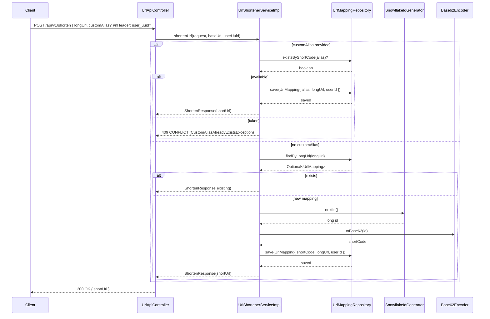
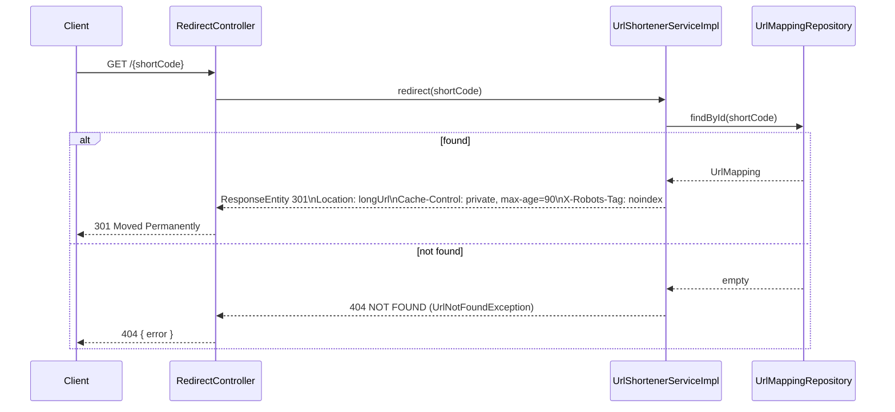

# URL Shortener - Sequence Diagrams

This document illustrates two primary flows: URL shortening and redirection.

## 1) Shorten URL (API)

### Notes
- The optional `user_uuid` header is stored with each mapping when present.
- When `customAlias` is provided, the service validates format and uniqueness before persisting.

## 2) Redirect

### Notes
- The redirect uses a permanent 301 with caching hints mirroring the production behavior described in the design document.
- No cache layer is included in this implementation; lookups go directly through JPA/H2 (or your configured DB).
